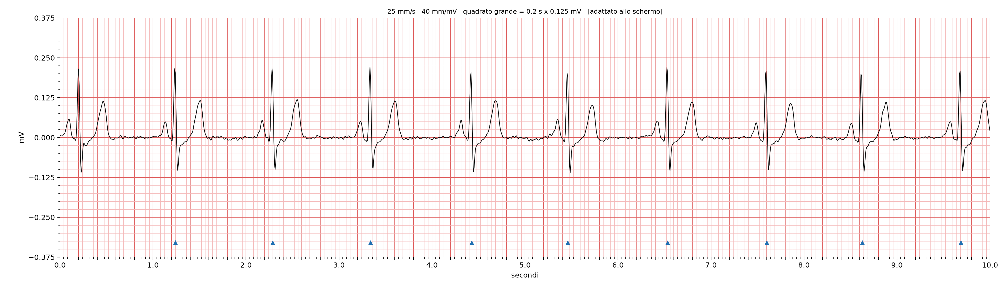

# scpecg

Lettore, convertitore, visualizzatore e analizzatore di file **SCP-ECG**
(EN 1064 / ISO 11073-91064) scritti da elettrocardiografi portatili
Creative / Gima **PC-80B**.

Nato perché il software in dotazione non bastava e i file `.SCP` non si aprono
con niente. Tutto quello che serve è qui: un file Python, `numpy` e
`matplotlib`.



## Cosa fa

- legge i file `.SCP` e ne stampa la struttura completa, sezione per sezione
- verifica CRC e coerenza del record
- esporta i campioni in CSV (tempo in secondi, ampiezza in millivolt)
- disegna il tracciato su carta millimetrata in scala clinica reale
  (25 mm/s, 10 mm/mV), stampabile e misurabile col righello
- apre una finestra interattiva con cursore a mirino, lettura continua di
  tempo e millivolt, e un caliper a due punti per misurare gli intervalli
- classifica il ritmo e la qualità del segnale, con soglie esplicite

Tutti i parametri di acquisizione (AVM, frequenza di campionamento, numero di
derivazioni, lunghezza dei blocchi) sono letti dall'header: niente è cablato.
Se cambi apparecchio, lo script si adatta.


## Installazione

**[Scarica l'app per macOS](https://github.com/silfox70/scpecg/releases/latest)**
(Apple Silicon, non firmata: al primo avvio clic destro → Apri)
 
 Oppure:  
 
```bash
git clone https://github.com/silfox70/scpecg.git
cd scpecg
python3 -m venv .venv
source .venv/bin/activate
pip install -r requirements.txt
```

Per l'interfaccia grafica serve anche `tkinter`. Su macOS con Python di
Homebrew non è incluso:

```bash
brew install python-tk@3.14
```

Senza `tkinter` la parte da riga di comando continua a funzionare.

## Uso

```bash
python scpecg.py                  # apre la finestra e chiede il file
python scpecg.py 10.SCP           # apre il file nella finestra interattiva
python scpecg.py --info 10.SCP    # struttura e analisi, senza produrre file
python scpecg.py --batch *.SCP    # converte tutto in CSV e PNG
```

Opzioni utili:

| opzione | effetto |
|---|---|
| `--mm-per-mv 10` | forza la scala clinica standard (default: automatica) |
| `--mm-per-s 50` | velocità carta doppia, per guardare la morfologia |
| `--seconds-per-row 5` | secondi per riga nel PNG |
| `--baseline none` | non rimuove l'offset dell'ADC |
| `--invert` | ribalta il segnale (verifica di elettrodi invertiti) |

## Il formato, e le libertà che il PC-80B si prende

Documentato in dettaglio in [docs/FORMATO.md](docs/FORMATO.md). In sintesi:

| aspetto | valore |
|---|---|
| versione | SCP-ECG 1.3 |
| sezioni presenti | 0, 1, 2, 3, 6, 9 |
| campionamento | 6666 µs → 150,02 Hz |
| durata | 4500 campioni → 30 s |
| AVM | 806 nV per unità |
| ADC | 12 bit, offset di mezza scala 2048, fondo scala 3,3 mV |
| banda passante | 0,5–40 Hz |
| compressione | nessuna (sezione 2 dichiara una tabella con una voce) |

Tre scostamenti dallo standard, tutti riconosciuti automaticamente:

1. **Il bit 15 dei campioni marca i picchi R.** Letti come `int16` con segno,
   quei campioni diventano valori negativi enormi e il tracciato sembra
   invertito. Vanno mascherati con `& 0x7FFF`; le loro posizioni sono il
   rilevamento dei battiti fatto a bordo dall'apparecchio, gratis.
2. **Codice derivazione 101**, fuori dalla tabella dello standard che si ferma
   a 64. L'apparecchio non distingue la modalità di misura: secondo il
   manuale, palmo ≈ DI, cavetti ≈ DII, torace ≈ derivazione V.
3. I marcatori del punto 1 compaiono solo in alcune registrazioni.

## Analisi del ritmo

Riproduce la **struttura** dei 17 verdetti del PC-80B (frequenza, regolarità,
qualità del segnale), non il suo algoritmo. Il costruttore non pubblica le
soglie: quelle nel dizionario `SOGLIE` sono in parte prese dal manuale e in
parte scelte qui, ognuna etichettata con la propria provenienza. Sono l'unico
punto da toccare per ritarare tutto.

**Non è una diagnosi.** È un descrittore di ritmo e qualità del segnale su una
sola derivazione non standard. L'interpretazione clinica spetta al medico.

## Privacy

I file `.SCP` e i `.CSV` che ne derivano sono dati sanitari. Il `.gitignore`
li esclude di default: se li committi restano nella storia di git anche dopo
averli cancellati.

## Applicazione autonoma

Per chi non vuole installare Python, si può costruire un eseguibile con
[PyInstaller](https://pyinstaller.org):

```bash
pip install pyinstaller
pyinstaller --clean --noconfirm scpecg.spec
```

Su macOS produce `dist/scpecg.app`. Pesa circa 124 MB: è quanto costano numpy
e matplotlib, già al netto di tutto l'escludibile.

Da riga di comando l'eseguibile vero sta dentro il bundle:

```bash
./dist/scpecg.app/Contents/MacOS/scpecg --info 13.SCP
```

**Al primo avvio macOS la blocca**, perché l'app non è firmata né notarizzata
(servirebbe un account sviluppatore Apple). Clic destro sull'app, poi "Apri",
poi conferma: dalla seconda volta parte normalmente. In alternativa:

```bash
xattr -dr com.apple.quarantine dist/scpecg.app
```

PyInstaller non compila per un sistema diverso da quello su cui gira: per
Windows serve una macchina Windows.

L'icona si rigenera con `python tools/make_icon.py`, che produce `.png`,
`.icns` e `.ico` da un unico disegno.

## Autore e licenza

Silvestro Scuderi — [github.com/silfox70](https://github.com/silfox70)

**GNU General Public License v3.0 o successiva.** Vedi [LICENSE](LICENSE).

Il programma è software libero: puoi usarlo, studiarlo, modificarlo e
ridistribuirlo. Se ne distribuisci una versione modificata, devi rilasciare
anche quella sotto GPL, con i sorgenti. La documentazione del formato è
frutto di reverse engineering: resta aperta a chi verrà dopo.
